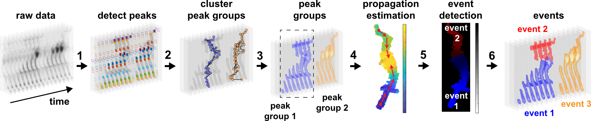
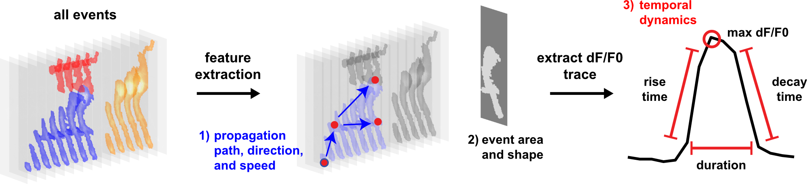
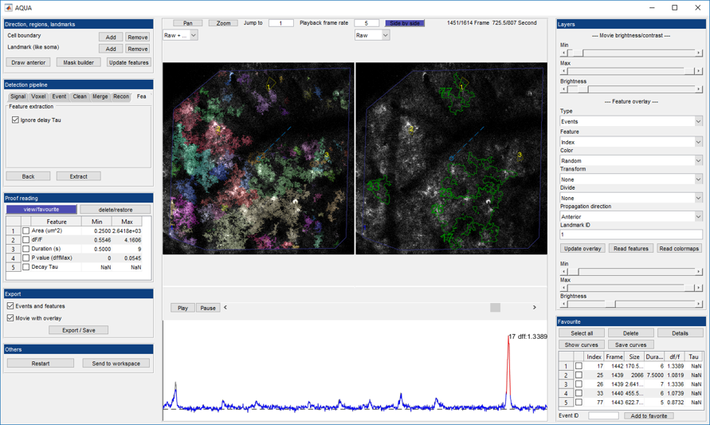

----------------------------------

AQuA (**A**strocyte **Qu**antification and **A**nalysis) is a tool to detect signalling events from microscopic time-lapse imaging data of astrocytes or other cell types. The algorithm is data-driven and based on machine learning principles, so, potentially, it can be applied across model organisms, fluorescent indicators, experimental modes, cell types, and imaging resolutions and speeds. If you have any feedback or issue, you can either post issue here or send email to Guoqiang Yu (yug@vt.edu).

- [More about AQuA](#more-about-aqua)
  - [From raw data to events](#from-raw-data-to-events)
  - [Extract features from events](#extract-features-from-events)
  - [Graphical user interface](#graphical-user-interface)
- [Download and installation](#download-and-installation)
  - [MATLAB GUI](#matlab-gui)
  - [MATLAB Without GUI](#matlab-without-gui)
  - [Fiji plugin](#fiji-plugin)
- [Getting started](#getting-started)
- [Example datasets](#example-datasets)
- [Reference](#reference)
- [Updates](#updates)

# More about AQuA
## From raw data to events
* In vivo and ex vivo
* GCaMP, GluSnFr 
* And more

## Extract features from events
* Size and location
* Duration, delta F/F, rising/falling time, decay time constant
* Propagation direction, speed
* And more

## Graphical user interface
* Step by step guide
* Event viewer
* Feature visualizer
* Proofreading and filtering
* Side by side view
* Region and landmark tool
* And more

# Download and installation
## MATLAB GUI

1. Download latest version **[here](https://github.com/yu-lab-vt/AQuA/archive/master.zip)**.
2. Unzip the downloaded file.
3. Start MATLAB.
4. Switch the current folder to AQuA's folder.
5. Double click `aqua_gui.m`, or type `aqua_gui` in MATLAB command line.

We tested on MATLAB versions later than 2017a. Earlier versions are not supported.

## MATLAB Without GUI
### Use aqua_cmd.m file
1. Double click `aqua_cmd.m` file.
2. Set the folder path 'p0' and target dataset name 'f0'.
3. Run the file.
4. The output files will be saved in a subfolder of 'p0'.

### Use aqua_batch.m file
1. Double click `aqua_batch.m` file.
2. Set the folder path 'p0', and for each target dataset, set the parameters in `AQuA/cfg/parameters_for_batch.csv`. Each dataset is corresponding to one parameter setting.
3. Run the file.
4. The output files will be saved in subfolders of 'p0'.

## Fiji plugin

1. Download **[here](https://github.com/yu-lab-vt/AQuA-Fiji/releases)**.
2. Put the downloaded `Aqua.jar` to the plugins folder of Fiji.
3. Open Fiji.
4. In the `Plugins` menu, click `Aqua`.
5. Open movie and choose project path in AQuA GUI.

Some browsers may show a warning when downloading the 'jar' file. Please choose 'keep file'.
Note: The Fiji version do not save the results in 'res' data structure in 'mat' file. If users want to obtain the results and process by themselves, please use MATLAB version.

# Getting started
If you are using AQuA for the first time, please read
**[the step by step user guide](https://drive.google.com/open?id=1a3lhe0dUth-5J1-S2fZlPOCZlPbeuvUr)**.

Or you can check the **[details on output files, extracted features, and parameter settings](https://drive.google.com/open?id=1assaXYBP6a0OOHrYGYBWjYO2pgwKR3Iu)**.

# Example datasets
You can try these real data sets in AQuA. These data sets are used in the supplemental of the paper.

**[Ex-vivo GCaMP dataset](https://drive.google.com/open?id=13tNSFQ1BFV__42TY0lZbHd1VYTRfNyfD)**

**[In-vivo GCaMP dataset](https://drive.google.com/open?id=1TjfFzlg_6BxsFX_l3-P92M5Rp_5j6wiM)**

**[GluSnFr dataset](https://drive.google.com/open?id=1XFJBE18sQTa6svXXRV1TidgNPSv-ldtY)**

We also provide some synthetic data sets. These are used in the simulation part of the paper.

**[Synthetic data sets](https://drive.google.com/open?id=1ljh-X7vkT7ryjk0mR7PXli_-nYThqK7h)**

# Reference
Yizhi Wang$, Nicole V. DelRosso$, Trisha V. Vaidyanathan, Michelle K. Cahill, Michael E. Reitman, Silvia Pittolo, Xuelong Mi, Guoqiang Yu#, Kira E. Poskanzer#, *Accurate quantification of astrocyte and neurotransmitter fluorescence dynamics for single-cell and population-level physiology*, Nature Neuroscience, 2019, https://www.nature.com/articles/s41593-019-0492-2 ($ co-first authors, # co-corresponding authors)

Yizhi Wang, Nicole V. DelRosso, Trisha Vaidyanathan, Michael Reitman, Michelle K. Cahill, Xuelong Mi, Guoqiang Yu, Kira E. Poskanzer, *An event-based paradigm for analyzing fluorescent astrocyte activity uncovers novel single-cell and population-level physiology*, BioRxiv 504217; doi: https://doi.org/10.1101/504217. [[Link to BioRxiv]](https://www.biorxiv.org/content/early/2018/12/21/504217)

# Updates

**5/8/2020:** 

This update changes the estimated noise in step 1. Previous version estimated the noise before smoothing and used it to detect active regions, which is unreasonable since the detection is based on the smoothed data. 
The current version estimates the noise after smoothing. With the accurate estimation, users can feel safe to set the intensity threshold as 2 or 3 instead of adjusting this parameter very hard.

**2/5/2020:** 

The update solves the problem that AQuA cannot detect event in the first frame and end frame.

**1/18/2020:** 

Add 'Save waves' button in favorite list part. Users could export the waves data of selected events as '.csv' files. 

**1/17/2020:** 

Add area under the curve feature for each event. Users could find them in 'fts.curve' structure. 
Update **[the step by step user guide](https://drive.google.com/open?id=1a3lhe0dUth-5J1-S2fZlPOCZlPbeuvUr)** and **[details on output files, extracted features, and parameter settings](https://drive.google.com/open?id=1assaXYBP6a0OOHrYGYBWjYO2pgwKR3Iu)**.

**1/16/2020:** 

The update adds the features of favorited events into the '.mat' result.

**12/20/2019:** 

Add new functin for cell regions and landmark reigons. The button "->" in the top-left corner of the GUI can let users to drag regions.

**12/19/2019:** 

Solve the issue that the detected events are forced to merge in "aqua_cmd.m" and "aqua_cmd_batch.m".

**12/18/2019:** 

The update fixes one bug existing in 'fix_events'.

**12/3/2019:** 

The update fixes one bug. Now each time "Update features" in GUI is clicked , the proof reading table will be updated.

**11/25/2019:** 

The update changes the GUI panel. Now users could select whether to output feature table or not.  

**11/22/2019:** 

The update saves the use of memory, while the results will not change.

**10/30/2019:** 

The update adds the random seed and makes the random variables controllable. Now with same parameter setting, AQuA will give same results. (Due to the randomness, the results will have a little difference before.)

**10/19/2019:** 

Repair the bug in Fiji version that 'minimum correlation' in merging step cannot be set to float data.

**10/17/2019:** 

1) The update avoids the error report when nothing is detected for `aqua_batch.m`. 

2) Allow `aqua_batch.m` to read a batch of cell boundaries and landmarks.

**10/16/2019:** 

The update adds the new script `aqua_batch.m` which can let users deal with multiple files. **[MATLAB Without GUI](#matlab-without-gui)** shows how to use it.  
